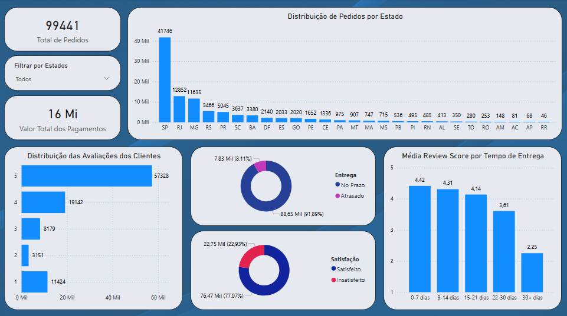
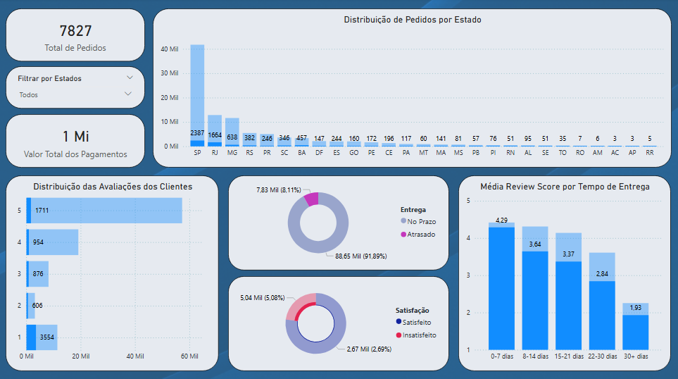
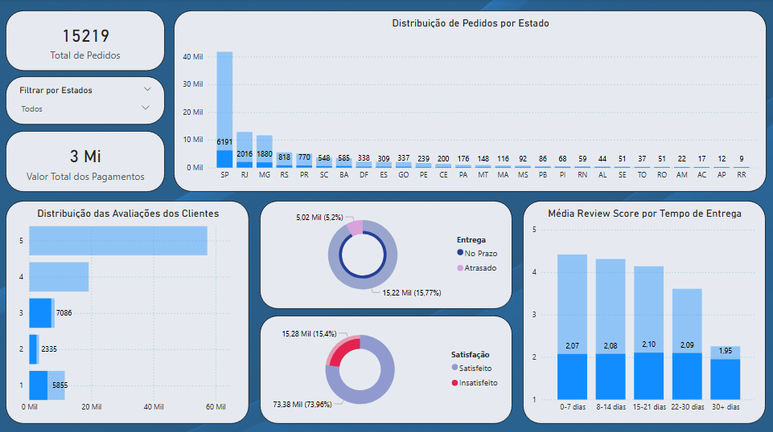
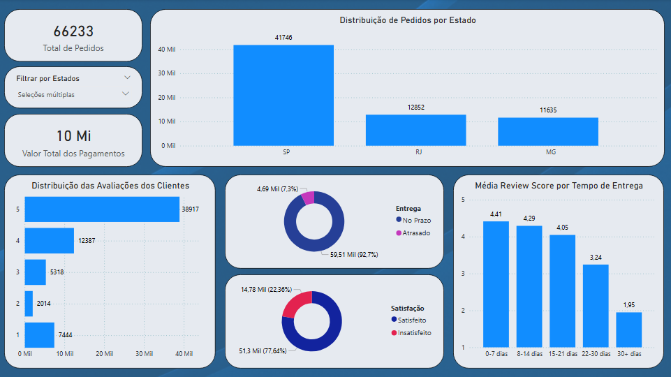
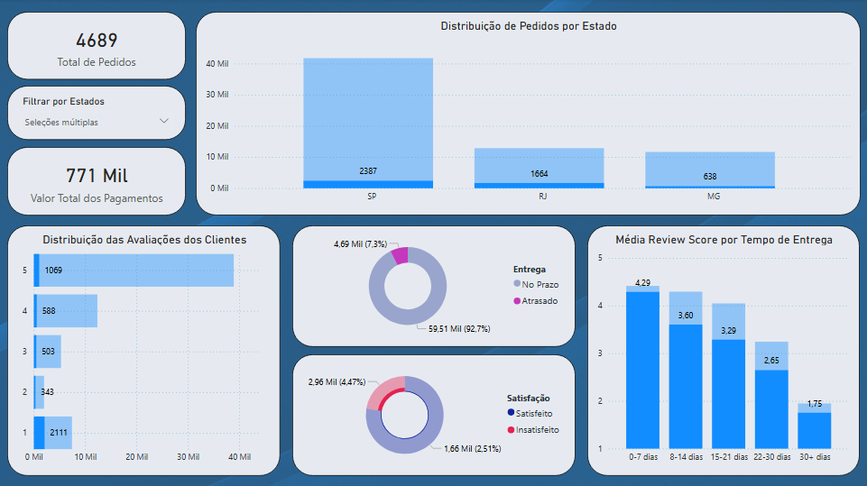

# Dashboard Power BI - Análise de Satisfação e Logística

Dashboard interativo desenvolvido para investigação de fatores que impactam a satisfação do cliente no e-commerce Olist, com foco em performance logística e análise regional.

---

## 📊 Visão Geral

Dashboard permite análise multidimensional através de filtros interativos, possibilitando identificação de padrões, gargalos operacionais e segmentação por região, tempo de entrega e nível de satisfação.

---

## 🔍 Análises Realizadas

### 1. Impacto de Atrasos na Satisfação

**Filtro aplicado:** Apenas pedidos que excederam a data estimada de entrega

**Insights identificados:**
- Atrasos impactam severamente a satisfação do cliente
- Reviews médios caem significativamente quando há atraso
- Confirmação da correlação negativa entre tempo de entrega e avaliação

**Conclusão:** O não cumprimento do prazo estimado é fator crítico para insatisfação, independentemente do tempo absoluto de entrega.

---

### 2. Insatisfação em Entregas no Prazo

**Filtro aplicado:** Pedidos entregues dentro do prazo + Reviews ≤ 3 (insatisfeitos)

**Insights identificados:**
- **15.219 pedidos** foram entregues no prazo mas receberam avaliação baixa
- Média de reviews permaneceu constante em ~2.0 independente da faixa de tempo (0-7 dias até 30+ dias)
- A frustração desses clientes **não está relacionada ao tempo de entrega**

**Conclusão:** Existe um grupo significativo de clientes insatisfeitos por fatores além da logística. Possíveis causas a investigar:
- Qualidade do produto
- Divergência entre expectativa e produto recebido
- Problemas no atendimento
- Avarias durante transporte

**Recomendação:** Investigação qualitativa dos comentários textuais desses pedidos para identificar causas raiz.

---

### 3. Análise Regional - SP, RJ e MG

**Filtro aplicado:** Apenas estados de São Paulo, Rio de Janeiro e Minas Gerais

**Contexto:** Estes três estados concentram a maior parte dos pedidos da plataforma.

**Distribuição de pedidos:**
- **São Paulo:** ~41.700 pedidos
- **Rio de Janeiro:** ~12.900 pedidos
- **Minas Gerais:** ~11.600 pedidos

---

### 4. Gargalo Logístico Identificado - Rio de Janeiro

**Filtro aplicado:** SP, RJ, MG + Apenas pedidos atrasados

**Insights críticos:**

| Estado | Total Pedidos | Pedidos Atrasados | Taxa de Atraso |
|--------|---------------|-------------------|----------------|
| **São Paulo** | ~41.700 | 2.387 | ~5,7% |
| **Rio de Janeiro** | ~12.900 | 1.654 | ~12,8% |
| **Minas Gerais** | ~11.600 | 638 | ~5,5% |

**Observações:**
- **Rio de Janeiro apresenta taxa de atraso 2,3x maior** que Minas Gerais, apesar de volume similar de pedidos
- São Paulo, com **mais de 3x o volume do RJ**, mantém taxa de atraso similar à de Minas Gerais
- RJ tem **quase o triplo de atrasos** comparado a MG em valores absolutos

**Conclusão:** Identificado **gargalo operacional específico no estado do Rio de Janeiro**. 

**Possíveis causas a investigar:**
- Problemas com centros de distribuição locais
- Desafios logísticos específicos da região (trânsito, infraestrutura)
- Parcerias com transportadoras regionais
- Concentração de sellers distantes do RJ

**Recomendações:** 
- Análise aprofundada da cadeia logística no Rio de Janeiro e possível realocação de estoque ou renegociação de parcerias de transporte.
- Ajustar estimativas de entrega para o Rio de Janeiro evitando espectativas irreais e consequente frustração do cliente
---

## 🎯 Funcionalidades do Dashboard

### Filtros Interativos
- **Filtro por Estado:** Permite análise regional específica ou comparativa
- **Filtro por Status de Entrega:** No prazo vs Atrasado
- **Filtro por Nível de Satisfação:** Segmentação por review score

### KPIs Dinâmicos
- Total de pedidos
- Valor total de pagamentos
- Percentual de entregas no prazo
- Percentual de clientes satisfeitos vs insatisfeitos

### Visualizações
- **Distribuição Geográfica:** Volume de pedidos por estado (gráfico de barras)
- **Status de Entrega:** Proporção no prazo vs atrasado (gráfico de rosca)
- **Reviews por Tempo:** Média de satisfação segmentada por faixa de tempo de entrega (colunas)
- **Distribuição de Avaliações:** Volume de pedidos por nota (1-5 estrelas)

### Análise Cruzada
Todos os visuais são interconectados, permitindo drill-down e identificação de padrões específicos através de seleções múltiplas.

---

## 💡 Principais Conclusões

1. **Tempo de entrega é fator crítico** para satisfação em pedidos atrasados
2. **Existe insatisfação não-logística significativa:** 15.219 pedidos no prazo com review baixo indicam problemas além da entrega
3. **Rio de Janeiro apresenta desafio operacional específico** com taxa de atraso desproporcional ao volume
4. **São Paulo demonstra operação eficiente** mantendo baixa taxa de atraso mesmo com volume 3x maior que RJ
